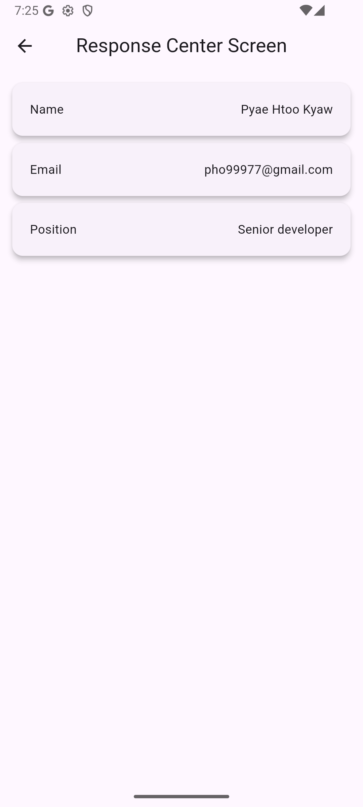
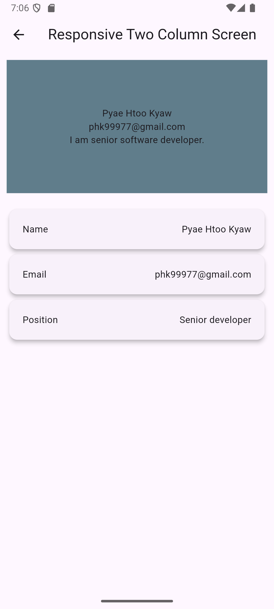
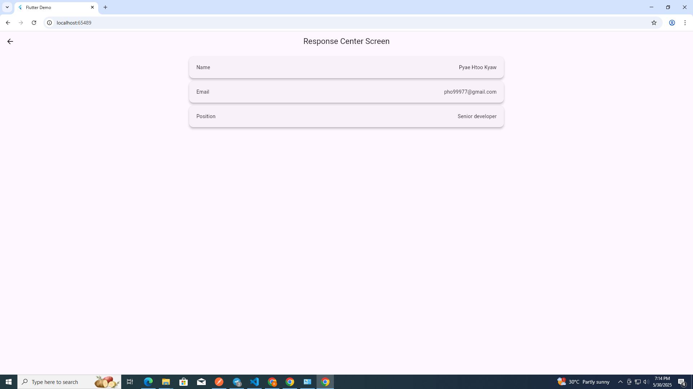

# responsive_phk

A Flutter package that helps you build responsive layouts effortlessly across different screen sizes and devices.

## Features

✅ Easily adapt your widgets to different screen sizes.  
✅ Lightweight and easy to use.  
✅ No external dependencies.

## Screenshots (Mobile)

|  |  |
|:--:|:--:|
| Centered Layout | Two-Column Layout |

## Screenshots (Web)

|  |  |
|:--:|:--:|
| Centered Layout | Two-Column Layout |

## Example usage

```dart
import 'package:example/data/info_list.dart';
import 'package:flutter/material.dart';
import 'package:responsive_phk/widgets/responsive_center.dart';

class ResponseCenterScreen extends StatelessWidget {
  const ResponseCenterScreen({super.key});

  @override
  Widget build(BuildContext context) {
    return Scaffold(
      appBar: AppBar(
        title: Text('Response Center Screen'),
        centerTitle: true,
      ),
      body: ResponsiveCenter(
        padding: EdgeInsets.all(10),
        child: ListView.builder(
          itemCount: info.length,
          itemBuilder: (context, index) {
            return Card(
              elevation: 5,
              child: Padding(
                padding: EdgeInsets.all(20),
                child: Row(
                  mainAxisAlignment: MainAxisAlignment.spaceBetween,
                  children: [
                    Text(info[index].title ?? ''),
                    Text(info[index].description)
                  ],
                ),
              ),
            );
          },
        ),
      ),
    );
  }
}


## Getting started

Add this package to your `pubspec.yaml`:

```yaml
dependencies:
  responsive_phk:
    git:
      url: https://github.com/pyaehtookyaw/responsive_phk.git
