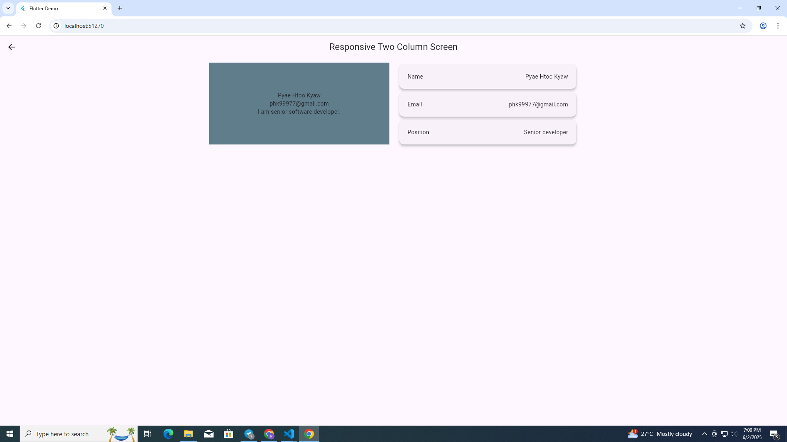

<!--
This README describes the package. If you publish this package to pub.dev,
this README's contents appear on the landing page for your package.

For information about how to write a good package README, see the guide for
[writing package pages](https://dart.dev/tools/pub/writing-package-pages).

For general information about developing packages, see the Dart guide for
[creating packages](https://dart.dev/guides/libraries/create-packages)
and the Flutter guide for
[developing packages and plugins](https://flutter.dev/to/develop-packages).
-->

<!-- TODO: Put a short description of the package here that helps potential users
know whether this package might be useful for them.

## Features

TODO: List what your package can do. Maybe include images, gifs, or videos.

## Getting started

TODO: List prerequisites and provide or point to information on how to
start using the package.

## Usage

TODO: Include short and useful examples for package users. Add longer examples
to `/example` folder.

```dart
const like = 'sample';
```

## Additional information

TODO: Tell users more about the package: where to find more information, how to
contribute to the package, how to file issues, what response they can expect
from the package authors, and more. -->

# responsive_phk

A new Flutter package project that helps you build responsive layouts effortlessly.

## Features

✅ Easily adapt your widgets to different screen sizes.  
✅ Lightweight and easy to use.  
✅ No external dependencies.




## Getting started

Add this package to your `pubspec.yaml`:

```yaml
dependencies:
  responsive_phk:
    git:
      url: https://github.com/pyaehtookyaw/responsive_phk.git
